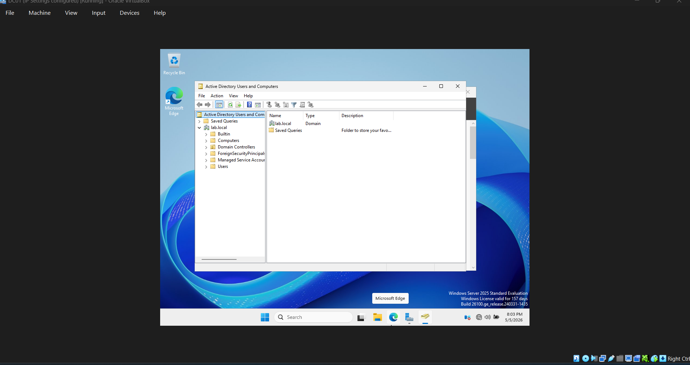
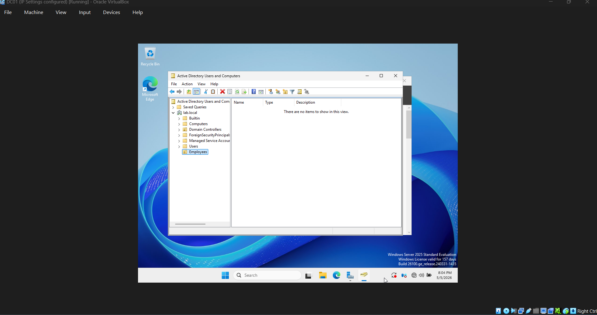
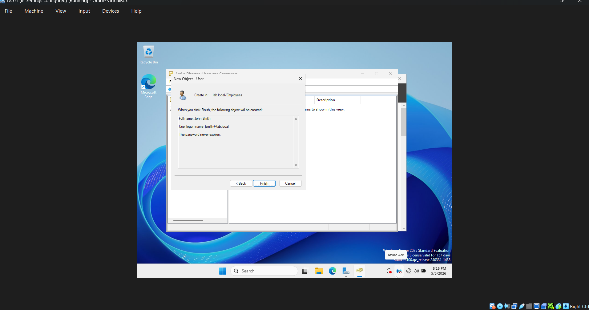
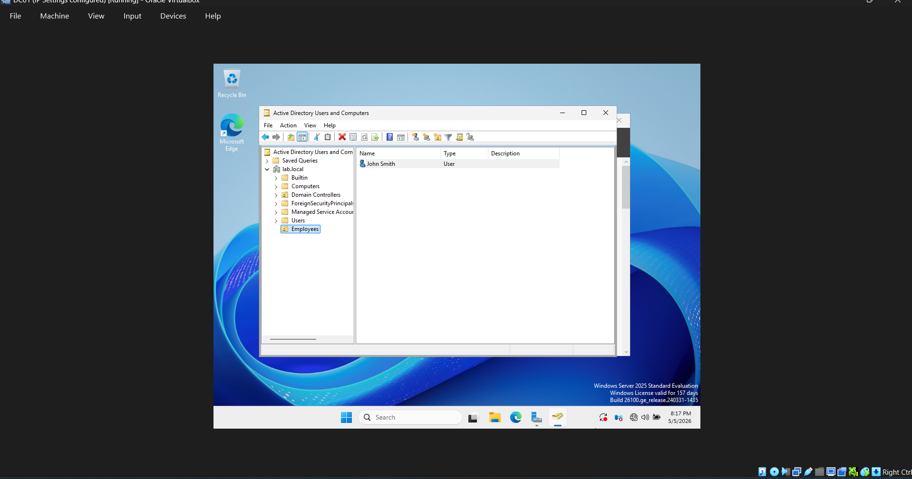
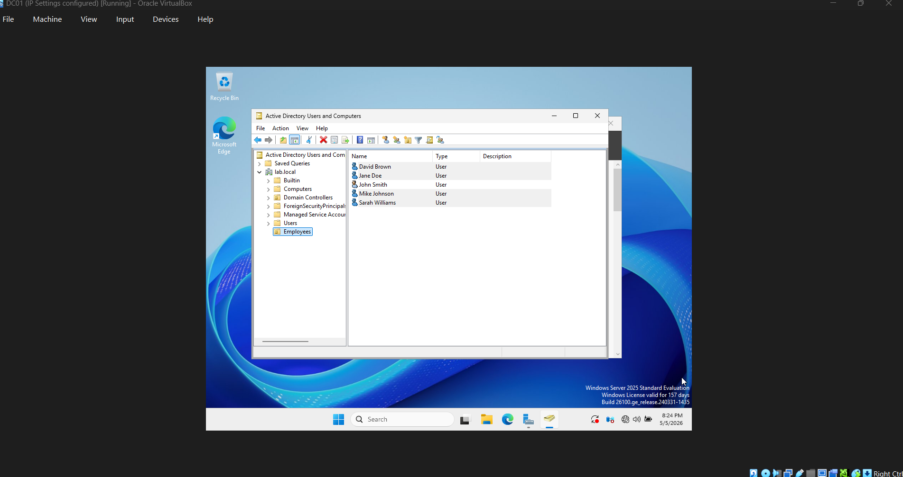
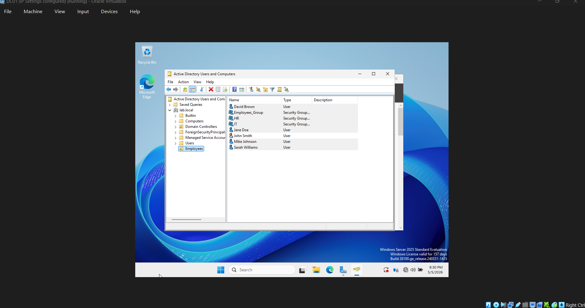
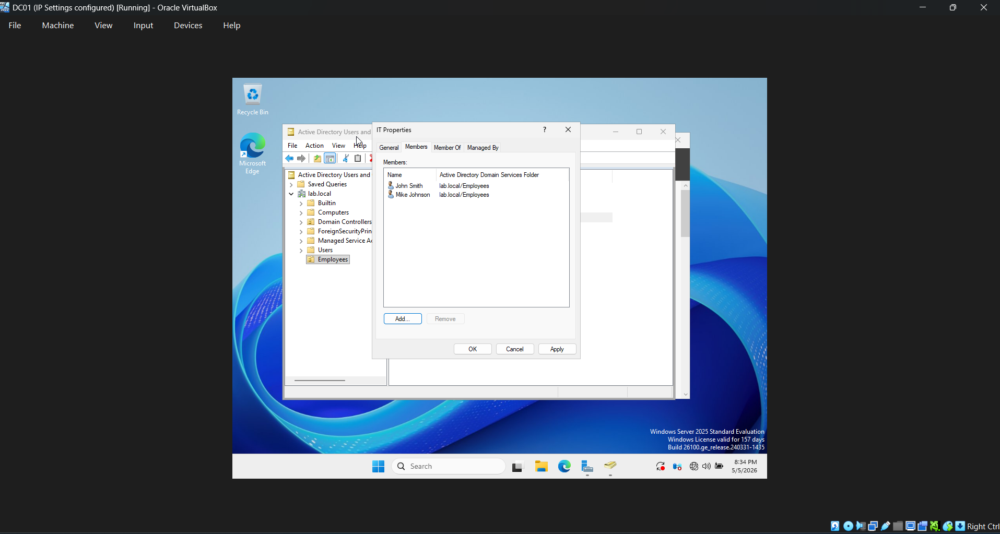
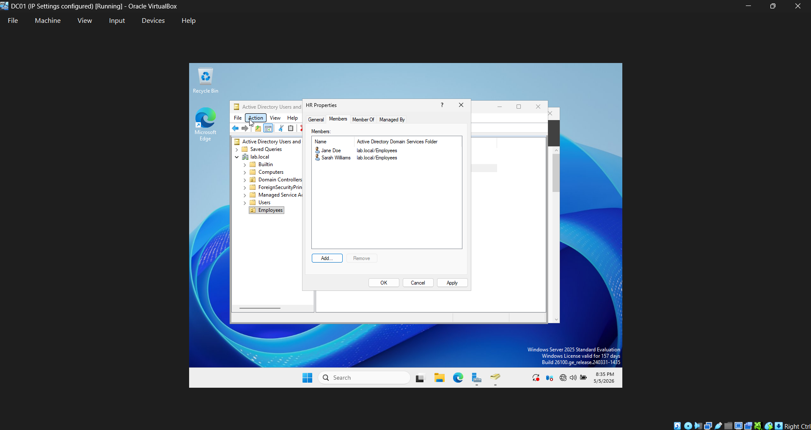
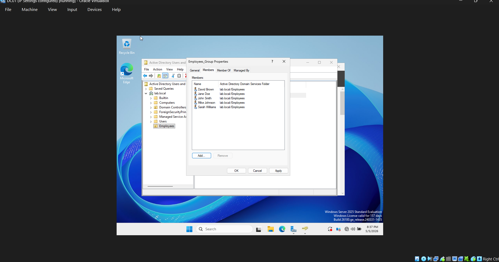

## Screenshots

### 1. Active Directory Opened

### 2. Employees OU Created

### 3. User Creation Form

### 4. User Added to Employees OU

### 5. All Users Created

### 6. Group Creation

### 7. IT Group Members

### 8. HR Group Members

### 9. Employees Group Members
